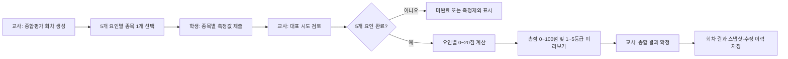

# PAPS 회차 종합점수·등급 기록 구현계획

- 작성일: 2026-08-26
- 상태: 승인안 변경으로 대체됨
- 구현 여부: 미구현
- 대상 프로젝트: `paps-tracker`

> 2026-08-26 사용자 승인에서 체지방 측정을 제외하기로 결정했다. 이 문서는 공식 5요인 규정 조사 근거로만 보존하며, 실제 구현은 `2026-08-26-paps-four-factor-round-score-grade.md`를 따른다.

## 1. 목표

교사가 한 번의 PAPS 평가 회차를 만들고 학생이 필요한 측정을 모두 마치면, 학생별로 다음 결과를 계산·확정·보관한다.

- 5개 체력요인별 대표 기록과 점수(각 0~20점)
- 회차 종합점수(0~100점)
- 종합 체력등급(1~5등급)
- 계산에 사용한 규정 버전, 학생 기준정보, 대표 시도, 확정 이력

현재의 단일 종목 또는 임의 종목 묶음 기능은 유지하되, 법정 PAPS 종합평가와 혼동되지 않도록 별도 흐름으로 구분한다.

## 2. 공식 근거와 구현 해석

### 확인한 공식 자료

1. [학교건강검사규칙 제7조·제8조(현행)](https://law.go.kr/LSW/lsInfoP.do?ancYnChk=0&chrClsCd=010202&efYd=20250310&lsiSeq=269791&urlMode=lsInfoP)
2. [학교건강검사규칙 별표 5: 학생건강체력평가의 평가점수 산정기준](https://law.go.kr/LSW/flDownload.do?bylClsCd=110201&flSeq=45995793&gubun=)
3. [학교건강검사규칙 별표 6: 학생건강체력평가의 종합 체력등급](https://www.law.go.kr/LSW/flDownload.do?bylClsCd=110201&flSeq=149708837&gubun=)
4. [경기도교육청 2026년 나이스 학생건강체력평가(PAPS) 시스템 사용자 설명서 게시물](https://www.goe.go.kr/goe/na/ntt/selectNttInfo.do?mi=10961&nttSn=2347912)
5. [2026년 나이스 PAPS 학교용 사용자 설명서 v2.1 PDF](https://www.goe.go.kr/resource/goe/na/bbs_2675/2026/04/def7ca40-d676-4190-8329-2888d6491330.pdf)

### 구현에 반영할 규정

- 정시평가는 심폐지구력, 유연성, 근력·근지구력, 순발력, 체지방의 5개 요인에서 각각 한 종목을 선택한다.
- 각 요인의 원 측정값을 공식 기준에 따라 0~20점으로 환산한다.
- 5개 요인 점수 합계가 종합점수이며 범위는 0~100점이다.
- 종합 체력등급은 다음과 같다.

| 종합점수 | 종합 체력등급 |
|---:|---:|
| 80~100 | 1등급 |
| 60~79 | 2등급 |
| 40~59 | 3등급 |
| 20~39 | 4등급 |
| 0~19 | 5등급 |

- 2025-03-10 시행 규칙 기준 초등학교 4~6학년은 평가 대상이며, 3학년은 학교장이 선택하여 실시할 수 있다.
- 정시평가는 1회차, 수시평가는 2회차 이후라는 나이스 운영 개념을 데이터 모델에 반영한다.
- 미측정·측정제외 학생은 0점으로 간주하지 않는다. `미완료` 또는 `측정제외` 상태로 명확히 보관한다.

### 중요한 계산 원칙

현재 앱의 종목별 `1~5등급`은 종합점수의 입력값이 아니다. 종목별 등급을 더하거나 평균 내지 않고, 원 측정값에서 공식 `0~20점`을 먼저 계산한 뒤 다섯 점수를 합산해야 한다.

별표 5는 구간 분할 원칙을 제시하고 세부 점수는 나이스에서 자동 산출하도록 안내한다. 따라서 정확한 나이스 세부 점수표 또는 동일 결과를 보장하는 공식 계산 기준을 확보하지 못한 종목은 추정 구현하지 않는다. 해당 종목이 포함된 공식 회차의 확정 기능은 비활성화하는 방식으로 실패를 닫는다.

## 3. 현재 구현 분석

### 현재 잘 되어 있는 부분

- 원 시도 전체를 보존하고 교사가 대표 시도를 선택하는 구조가 있다.
- 공식 세션과 연습 세션이 분리되어 있다.
- 단일 종목과 여러 종목 세션 그룹을 지원한다.
- Google Sheets 원본 탭과 파생 요약 탭을 구분한다.
- 접근 토큰 검증, 입력 범위 검증, 수정 로그, 오류 로그가 이미 있다.
- 현재 자동 테스트 296개, 린트, 타입 검사가 통과한다.

### 종합평가 구현을 막는 구조적 차이

1. `PAPSEventDefinition`에 체력요인 정보가 없다.
2. `sessionGroupId`는 임의 종목 묶음일 뿐, 다섯 요인이 완성된 공식 회차라는 계약이 없다.
3. 체지방 요인 종목이 없다. 최소 구현으로 키·몸무게 기반 BMI 측정이 필요하다.
4. 현재 계산기는 종목별 1~5등급만 반환하며 0~20점 계산기가 없다.
5. 학생별 회차 완료 여부, 종합점수, 종합등급, 확정 상태를 저장할 구조가 없다.
6. 학생 입력 직후 표시되는 `이번 기록 기준 등급`은 해당 원 시도의 종목 등급이므로, 교사가 고른 대표값 및 회차 종합 결과와 다를 수 있다.
7. 계산 시 학생 명단의 현재 학년·성별을 읽는다. 명단이 바뀌면 과거 결과가 달라질 수 있으므로 측정 당시 기준정보 스냅샷이 필요하다.
8. 2반 분할 세션은 학년별 종목 적격성 검사가 충분하지 않아, 서로 다른 학년 반 조합에서 잘못된 종목이 허용될 수 있다.
9. 시트 템플릿 버전이 앱 버전과 분리된 초기값에 머물러 있고, 새 결과 탭을 위한 명시적 마이그레이션 경로가 없다.

## 4. 제안하는 제품 구조

### 세션과 종합평가 회차 분리

교사 생성 화면에서 다음 두 모드를 분리한다.

1. `PAPS 종합평가 회차`
   - 공식 점수·종합등급을 산출한다.
   - 5개 요인에서 각각 정확히 1개 종목을 선택해야 한다.
   - 정시/수시 회차, 학년도, 대상 반을 기록한다.
2. `종목 기록·연습`
   - 기존 단일/다종목 세션 기능을 유지한다.
   - 종목별 기록과 종목 등급은 제공할 수 있지만 공식 종합점수는 만들지 않는다.

기존 세션 그룹을 자동으로 종합평가 회차로 변환하지 않는다. 과거 데이터에는 요인 완결성, 체지방, 규정 버전 정보가 없기 때문이다.

### 사용자 흐름



## 5. 도메인 모델 설계

### 체력요인과 종목

```ts
type PAPSFactorId =
  | "cardiorespiratory-endurance"
  | "flexibility"
  | "strength-endurance"
  | "power"
  | "body-composition";
```

- 모든 종목 정의에 `factorId`를 추가한다.
- BMI 종목을 추가한다.
  - 입력: `heightCm`, `weightKg`
  - 파생값: `bmi`
  - 공식 자릿수 처리 규칙과 원 입력값을 모두 보존한다.
- 향후 체지방률 종목을 넣을 수 있도록 체지방 요인은 확장 가능한 구조로 둔다.

### 평가 회차

개념 이름은 `PAPSAssessmentRound`를 권장한다.

필수 필드:

- `id`, `name`, `schoolId`, `teacherId`, `academicYear`
- `roundType`: `regular | followUp`
- `roundNumber`: 1 이상
- `status`: `draft | open | review | finalized | archived`
- `classTargets`
- `selectedEventsByFactor`
- `ruleVersion`
- `createdAt`, `openedAt`, `finalizedAt`

기존 `PAPSSession`은 실제 측정 입력 단위로 유지하고 `assessmentRoundId`로 회차에 연결한다. 이렇게 하면 현재 라우트와 시도 저장 구조를 재사용하면서도 임의 세션 그룹과 공식 회차를 구분할 수 있다.

### 학생별 회차 결과

개념 이름은 `PAPSStudentRoundResult`를 권장한다.

필수 필드:

- 식별: `roundId`, `studentId`, `revision`
- 상태: `incomplete | excluded | ready | finalized | stale`
- 학생 기준정보 스냅샷: 학년, 성별, 반, 번호
- 5개 요인별:
  - 종목 ID
  - 대표 시도 ID
  - 원 측정값 및 세부값
  - 요인 점수 0~20
- `totalScore`
- `overallGrade`
- `ruleVersion`, `ruleSource`
- `calculatedAt`, `finalizedAt`, `finalizedBy`
- `supersedesRevision` 또는 이전 확정본 연결 정보

확정본은 가변 요약값이 아니라 감사 가능한 스냅샷으로 저장한다. 대표 시도가 바뀌면 확정본을 조용히 덮어쓰지 않고 `stale`로 표시한 뒤 재확정하여 새 revision을 만든다.

## 6. 점수 계산 계약

순수 함수 계층을 다음처럼 분리한다.

1. `normalizeMeasurement`
   - 종목별 공식 반올림·절사·올림 규칙 적용
2. `calculateFactorScore`
   - 학년, 성별, 종목, 정규화 측정값, 규정 버전으로 0~20점 반환
3. `calculateOverallResult`
   - 다섯 요인 점수의 완전성을 검사
   - 합계와 종합등급 반환
4. `buildRoundResultSnapshot`
   - 대표 시도와 학생 기준정보, 규정 출처를 고정한 저장 객체 생성

규칙 데이터는 코드에 흩어진 숫자가 아니라 버전이 있는 정적 데이터 모듈로 둔다.

- 예: `rules/2025-03-10/elementary/*.ts`
- 각 규칙 파일에 출처 URL, 시행일, 지원 학년·성별·종목을 함께 기록한다.
- 정확한 세부 점수표를 확보하지 못한 조합은 `unsupported`로 처리하고 공식 확정을 막는다.

## 7. 화면 설계

### 교사: 회차 생성

- 첫 선택: `PAPS 종합평가` / `종목 기록·연습`
- 종합평가 선택 시 5개의 요인 카드를 고정 표시한다.
- 각 카드에서 허용 종목을 1개만 선택한다.
- 대상 반에 포함된 모든 학년에 적격한 종목만 선택 가능하게 한다.
- 누락된 요인은 카드와 상단 오류 요약에서 동시에 안내한다.
- 다섯 요인이 유효할 때 `종합평가 회차 만들기`를 활성화한다.

### 학생: 측정

- 학생을 고른 뒤 본인의 5개 요인 진행상태를 `완료/미측정`으로 보여준다.
- 다른 학생의 누적 기록은 노출하지 않는다.
- 측정 저장 후 `다음 미측정 종목`을 가장 중요한 다음 행동으로 제시한다.
- 이 버튼에는 프로젝트 지침에 따라 `gi-pulse` 계열 아우라 강조를 적용하고 `prefers-reduced-motion`에서는 정적 강조로 대체한다.
- 모든 측정이 끝나도 교사 대표값 확정 전에는 `최종 종합결과`라고 표시하지 않는다.

### 교사: 결과 검토 및 확정

- 행: 학생, 열: 5개 체력요인인 완료 매트릭스를 제공한다.
- 학생별로 대표 시도와 환산 점수를 검토한다.
- 미완료, 규칙 미지원, 대표값 미선택, 측정제외를 서로 다른 상태로 표시한다.
- 준비된 학생에 한해 종합점수·등급 미리보기를 보여준다.
- `종합 결과 확정` 버튼은 모든 선행조건이 충족된 경우에만 활성화하고, 중요한 필수 행동이므로 `gi-pulse` 계열 강조를 적용한다.
- 확정 후 대표값이 바뀌면 재확정 필요 배지를 표시한다.

### 학생: 최종 결과

교사가 확정한 이후에만 다음을 표시한다.

- 회차명과 측정일
- 5개 요인별 기록과 점수
- 종합점수와 종합 체력등급
- `이 결과는 입력된 PAPS 측정값을 공식 기준으로 환산한 기록이며 의료 진단이 아닙니다.` 안내

## 8. API 및 상태 전이

권장 API 단위:

- `POST /api/assessment-rounds`: 회차 생성
- `GET /api/assessment-rounds/:id`: 회차 및 진행상태 조회
- `POST /api/assessment-rounds/:id/preview`: 최신 대표값으로 계산 미리보기
- `POST /api/assessment-rounds/:id/students/:studentId/finalize`: 학생 1명 확정
- `POST /api/assessment-rounds/:id/finalize-ready`: 준비된 학생 일괄 확정
- `POST /api/assessment-rounds/:id/students/:studentId/exclude`: 측정제외 및 사유 기록

확정 API는 다음 순서로 동작한다.

1. 최신 학생·세션·시도·대표값을 다시 읽는다.
2. 학생 기준정보와 규정 버전을 검증한다.
3. 다섯 요인의 완전성과 정확히 한 종목 조건을 검증한다.
4. 점수와 등급을 서버에서 재계산한다.
5. 요청 revision과 현재 revision이 같을 때만 멱등 저장한다.
6. 수정 로그를 남긴다.

클라이언트가 보낸 총점·등급을 신뢰하지 않는다.

## 9. Google Sheets 스키마와 마이그레이션

새 탭 `회차종합결과`를 추가한다.

권장 열:

1. 회차 ID
2. 학생 ID
3. revision
4. 결과 상태
5. 학년도/회차 유형/회차 번호
6. 학년/성별/반/번호 스냅샷
7. 각 요인의 종목 ID/대표 시도 ID/원 측정값/점수
8. 종합점수
9. 종합등급
10. 규정 버전/출처
11. 계산·확정 시각/확정 교사
12. 이전 revision

마이그레이션 원칙:

- 시트 템플릿 버전을 올리고 필요한 탭·헤더를 검증한다.
- 이전 템플릿은 읽기 호환하되 종합평가 생성 전에 교사가 안전한 자동 보강을 실행하게 한다.
- 과거 임의 세션 그룹을 회차종합결과로 자동 변환하지 않는다.
- 서버 프로세스 내부 잠금만 믿지 않는다. 확정 직전 재조회와 revision 비교로 Vercel 다중 인스턴스 중복 확정을 방지한다.

## 10. 개인정보·권한 개선

종합평가와 별개로 현재 학생 화면의 이름 선택 구조는 같은 링크를 가진 학생이 다른 학생을 선택해 누적 기록을 볼 가능성이 있다. 다음 중 최소 하나를 구현 범위에 포함한다.

- 학생 화면에서는 현재 제출 결과만 보이고 누적 이력은 교사 화면에만 제공한다. 권장안이다.
- 또는 학생별 짧은 확인코드/QR 링크로 본인 범위를 제한한다.

최종 결과 열람 링크는 세션 전체 공유 토큰과 분리하고, 만료 또는 교사 폐기 기능을 둔다.

## 11. 테스트 우선 구현 순서

### 1단계: 규정 고정과 골든 테스트

- 공식 세부 점수표와 BMI 계산 규칙을 확보한다.
- 공식 설명서 예시를 골든 fixture로 작성한다.
- 모든 학년·성별·종목의 경계값을 테스트한다.
- 종합점수 경계 `19/20`, `39/40`, `59/60`, `79/80`을 테스트한다.
- 종합유연성 고정 점수와 BMI 자릿수 규칙을 별도 테스트한다.

### 2단계: 도메인 모델과 계산기

- 체력요인, BMI 상세값, 회차, 결과 스냅샷 타입을 추가한다.
- 순수 점수 계산기와 완전성 검증을 구현한다.
- 기존 종목별 등급 기능과 이름을 분명히 분리한다.

### 3단계: 저장소와 마이그레이션

- 메모리 저장소에서 먼저 회차 생성·확정·revision을 구현한다.
- Google Sheets 탭과 스키마 마이그레이션을 추가한다.
- 멱등성, 동시 확정, 확정 후 대표값 변경을 통합 테스트한다.

### 4단계: 교사 UI

- 종합평가 생성기
- 완료 매트릭스
- 점수 미리보기와 확정/재확정
- 측정제외 처리

### 5단계: 학생 UI

- 다섯 요인 진행상태
- 다음 종목 안내
- 확정 후 최종 종합점수·등급 카드
- 타 학생 이력 비노출

### 6단계: 회귀·실사용 검증

- 기존 단일/다종목 세션, 대표값, 성장 그래프, CSV/XLSX 기능 회귀 테스트
- Node 22/npm 10 환경에서 테스트·린트·타입검사·프로덕션 빌드
- 모바일 390×812와 데스크톱에서 실제 교사→학생→교사 확정 흐름 검증
- 키보드, 스크린리더 이름, 오류 포커스, reduced-motion 검증

## 12. 함께 처리해야 할 프로젝트 개선점

### P0: 이번 기능의 정확성에 직접 영향

- 학생 학년·성별을 측정 시점에 스냅샷으로 보존한다.
- 2반 분할 세션도 각 대상 반 학년에 대해 종목 적격성을 검증한다.
- `이번 기록 기준 등급`을 `이 종목의 임시 등급`처럼 정확히 표현하고 최종 결과와 구분한다.
- 세부 점수표가 불완전한 상태에서는 공식 종합 결과를 확정하지 않는다.

### P0: 의존성 보안

`npm audit --omit=dev` 기준 고위험 취약점이 확인되었다. 기능 구현과 별도 커밋으로 다음을 처리한다.

- Next.js, NextAuth/Auth.js, PostCSS, Sharp 보안 업데이트
- 현재 버전에서 자동 수정 경로가 없는 `xlsx` 교체 또는 격리 검토
- 무분별한 `npm audit fix --force`는 사용하지 않고 회귀 테스트 후 단계적으로 갱신

### P1

- 학생 누적 이력의 타인 노출 가능성 차단
- 시트 스키마 버전과 자동 마이그레이션 도입
- 프로세스 로컬 잠금 대신 revision 기반 동시성 제어
- 측정제외·미완료·확정·재확정 상태와 감사 로그 도입

### P2

500줄을 넘는 운영 코드가 있어 해당 영역 수정 전에 책임별로 분리한다.

- `src/lib/store/paps-memory-store.ts`
- `src/lib/google/sheets-submit.ts`
- `src/components/teacher/settings-management.tsx`

## 13. 완료 기준

- 공식 종합평가 회차는 5개 요인에서 각 1종목이 없으면 생성되지 않는다.
- 미완료·측정제외 학생에게 0점이나 임의 종합등급이 생성되지 않는다.
- 지원되는 모든 종목의 점수가 공식 골든 fixture와 일치한다.
- 종합점수와 등급 경계가 별표 6과 일치한다.
- 확정 결과는 대표 시도, 학생 기준정보, 규정 버전과 함께 재현 가능하다.
- 확정 후 원자료 변경은 기존 결과를 자동 덮어쓰지 않고 재확정이 필요하다.
- 기존 연습/종목 기록 흐름은 공식 종합평가로 오인되지 않으며 회귀가 없다.
- 학생은 다른 학생의 누적 이력이나 최종 결과를 볼 수 없다.
- 테스트, 린트, 타입검사, Node 22 프로덕션 빌드, 실제 브라우저 흐름이 모두 통과한다.
- 앱의 `업데이트 내역`에 개발일과 변경 내용을 추가한다.

## 14. 사용자 검토가 필요한 결정

권장안을 다음과 같이 제안한다.

1. 공식 종합점수는 `PAPS 종합평가 회차`에서만 산출한다.
2. 다섯 요인이 모두 완료된 학생만 점수 미리보기가 가능하다.
3. 최종 기록은 교사의 명시적 `종합 결과 확정` 후 저장·노출한다.
4. 체지방 요인의 1차 지원 종목은 키·몸무게 기반 BMI로 한다.
5. 기존 세션 그룹과 과거 기록에는 종합점수·등급을 소급 생성하지 않는다.
6. 정확한 나이스 세부 점수표가 확보되지 않은 조합은 공식 확정을 막는다.
7. 학생 누적 이력은 교사 화면 전용으로 바꾸고, 학생 화면에는 본인의 현재 진행과 확정 결과만 보여준다.

이 결정이 승인되면 위 순서대로 테스트를 먼저 작성하고 구현을 시작한다.
